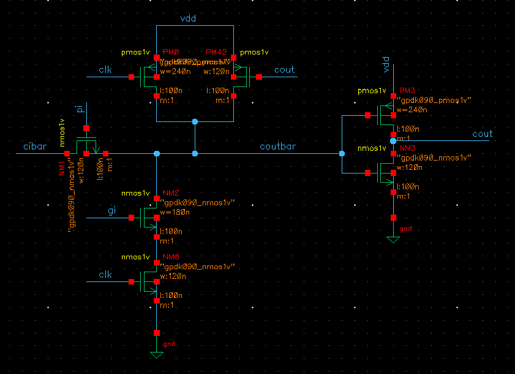

# 🔋 Low Power VLSI Design of Manchester Carry Chain Adder

This repository contains Verilog-based implementations and analysis of the **Manchester Carry Chain (MCC) Adder** using various CMOS logic styles. The designs are evaluated for power, delay, and Power-Delay Product (PDP) using industry-standard EDA tools.

---

## 🎯 Objective

- Implement the MCC Adder using:
  - Static CMOS Logic
  - Static CMOS with Transmission Gate
  - Dynamic CMOS Logic
  - Domino Logic
- Compare the designs on:
  - **Average Power**
  - **Delay**
  - **Power-Delay Product (PDP)**

---

## 🔍 Manchester Carry Chain: Quick Overview

The MCC enhances addition speed by using three key logic signals:
- **Generate (G):** `Gi = A · B`
- **Propagate (P):** `Pi = A ⊕ B`
- **Kill (K):** `Ki = A' · B'`

Recursive logic:
- `Cout = Gi + (Ci · Pi)`
- `Si = Pi ⊕ Ci`

---

## 🧩 Fundamental Circuits

### 🟩 Generate Circuit (AND - Static CMOS)

### 🟦 Propagate Circuit (XOR - Static CMOS)

### 🟨 Sum Circuit (XOR - Static CMOS)

### 🟥 Kill Circuit (NOR - Static CMOS)

---

## ⚙️ Implementations & Comparisons

### 1. Static CMOS Logic with Pass Transistor

> **🔍 Insight:** Robust, but higher delay due to full-swing static design. Pass transistor reduces transistor count but can degrade logic level.

- **Schematic:**
  

- **Waveform:**
  

- **Results:**
  - Static Power: 2.2 µW
  - Dynamic Power: 925 µW
  - Average Power: 41 µW
  - Delay: 122 ps
  - **PDP:** 0.0055 pJ

---

### 2. Static CMOS Logic with Transmission Gate

> **🔍 Insight:** Uses bidirectional switching; improves signal integrity and slightly reduces delay.

- **Transmission Gate:**
  

- **MCC with Transmission Gate:**
  

- **Waveform:**
  

- **Results:**
  - Static Power: 2.2 µW
  - Dynamic Power: 700 µW
  - Average Power: 40 µW
  - Delay: 110 ps
  - **PDP:** 0.0044 pJ

---

### 3. Dynamic CMOS Logic

> **🔍 Insight:** Fast due to fewer transistors and lower parasitic capacitance. Power-hungry due to clocked precharge-evaluate phases.

- **Dynamic Logic Circuit:**
  

- **MCC in Dynamic Logic:**
  

- **Waveform:**
  

- **Results:**
  - Static Power: 2.2 µW
  - Dynamic Power: 924 µW
  - Average Power: 93 µW
  - Delay: 41 ps
  - **PDP:** 0.0038 pJ

---

### 4. Domino Logic

> **🔍 Insight:** Best performance due to keeper transistor, full swing output, and efficient cascading.

- **Domino Logic Circuit:**
  

- **MCC with Domino Logic:**
  

- **Waveform:**
  

- **Results:**
  - Static Power: 2.2 µW
  - Dynamic Power: 922 µW
  - Average Power: 90 µW
  - Delay: 37 ps
  - **PDP:** 0.0033 pJ

---

## 📊 Comparative Table

| Logic Type                   | Avg Power (µW) | Delay (ps) | PDP (pJ)   |
|-----------------------------|----------------|------------|------------|
| Static CMOS                 | 41             | 122        | 0.0055     |
| Static + Transmission Gate  | 40             | 110        | 0.0044     |
| Dynamic CMOS                | 93             | 41         | 0.0038     |
| Domino Logic                | 90             | 37         | 0.0033     |

---
